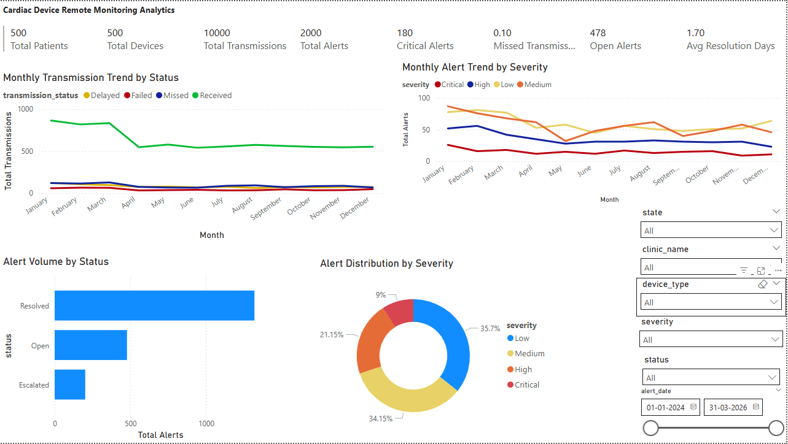
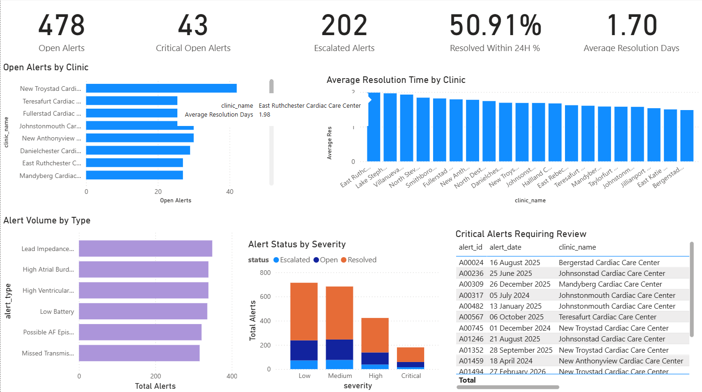
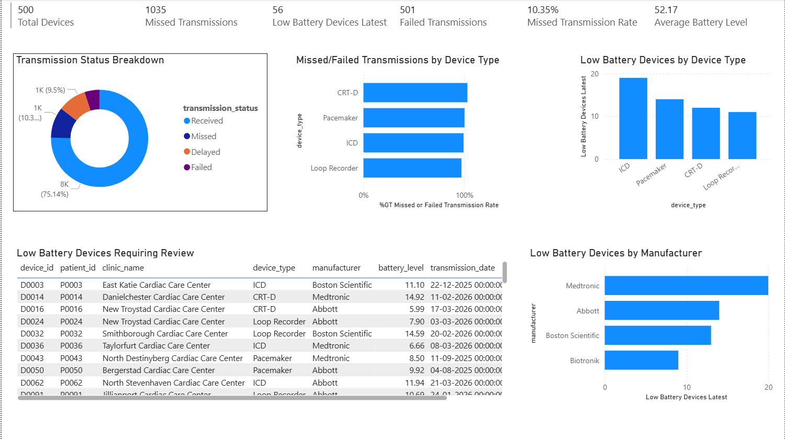

# Cardiac Device Remote Monitoring Analytics Dashboard

## Project Overview

This project simulates a healthcare SaaS analytics use case for cardiac device remote monitoring. The goal is to help clinical and operations teams monitor patient device transmissions, unresolved alerts, missed transmissions, device risk, and clinic workload.

The project was built using synthetic healthcare data to avoid privacy concerns while still creating a realistic analytics workflow.

## Business Problem

Cardiac care teams receive large volumes of remote transmissions and alerts from patients with implanted cardiac devices such as pacemakers, ICDs, CRT-D devices, and loop recorders.

Without effective reporting, teams may struggle to identify unresolved alerts, delayed resolutions, missed transmissions, low-battery devices, and clinics with high operational workload.

This dashboard helps stakeholders answer questions such as:

- Which clinics have the highest unresolved alert volume?
- What percentage of alerts are critical or escalated?
- Which device types have the highest missed transmission rate?
- Which devices may need attention due to low battery?
- How is alert volume changing month over month?
- Which clinics have the highest workload?

## Tools Used

- Python
- Pandas
- NumPy
- Faker
- PostgreSQL
- SQL
- Power BI

## Dataset

The dataset is synthetically generated and contains:

- 500 patients
- 500 cardiac devices
- 10,000 device transmissions
- 2,000 alerts
- 1,000 diagnostic findings
- 1,500 appointments
- 20 clinics
- 80 clinicians

## Database Tables

The PostgreSQL database contains the following tables:

- patients
- clinics
- clinicians
- devices
- transmissions
- alerts
- diagnostic_findings
- appointments

## Dashboard Pages

### 1. Executive Overview

Provides a high-level summary of patients, devices, transmissions, alerts, open alerts, critical alerts, missed transmission rate, and average resolution time.



### 2. Alert Management

Tracks open alerts, critical alerts, escalated alerts, alert resolution performance, alert types, and clinic-level alert volume.



### 3. Device Monitoring

Monitors device health, transmission status, missed transmissions, failed transmissions, battery levels, signal quality, and low-battery devices.



### 4. Clinic Operations

Analyzes clinic workload using patient count, device count, alert volume, appointment volume, clinician count, and alerts per clinician.


## Key Insights

- Built a monitoring dashboard for 500 patients, 500 devices, 10,000+ transmissions, and 2,000+ alerts.
- Identified open and critical alerts requiring follow-up.
- Tracked missed and failed transmissions across device types.
- Highlighted low-battery devices and device monitoring risks.
- Measured clinic workload using alerts, appointments, patients, and clinicians.
- Created SQL views to support dashboard reporting and ad hoc analysis.

## SQL Analysis

The project includes SQL queries for:

- Monthly transmission trends
- Alert severity distribution
- Open alerts by clinic
- Critical unresolved alerts
- Average alert resolution time
- Alerts resolved within 24 hours
- Missed transmission rate by device type
- Low-battery devices
- Most common diagnostic findings
- Clinic workload analysis
- Data quality checks

## Project Workflow

1. Generated synthetic cardiac monitoring data using Python.
2. Loaded CSV files into PostgreSQL.
3. Designed relational tables with primary and foreign keys.
4. Wrote SQL queries for business and clinical operations analysis.
5. Created SQL views for dashboard reporting.
6. Built a 4-page Power BI dashboard.
7. Documented insights and business impact.

## How to Run This Project

### 1. Clone the repository

```bash
git clone https://github.com/your-username/cardiac-device-monitoring-analytics.git
cd cardiac-device-monitoring-analytics
```

### 2. Install dependencies

```
pip install -r requirements.txt
```

### 3. Generate synthetic data

```
python scripts/generate_synthetic_data.py
```

### 4. Create PostgreSQL database

Create a database named:

```
CREATE DATABASE cardiac_monitoring;
```

### 5. Create tables

Run:

```
sql/01_create_tables.sql
```

### 6. Import CSV files

Import the CSV files from:

```
data/raw/
```

Import order:

1. clinics.csv
2. clinicians.csv
3. patients.csv
4. devices.csv
5. transmissions.csv
6. alerts.csv
7. diagnostic_findings.csv
8. appointments.csv

### 7. Run SQL analysis and dashboard views

Run:

```
sql/03_business_questions.sql
sql/04_dashboard_views.sql
```

### 8. Open Power BI dashboard

```
dashboards/cardiac_device_monitoring_dashboard.pbix
```

## Business Impact

This project demonstrates how analytics can support healthcare SaaS teams by improving visibility into alert management, device monitoring, clinic workload, and operational reporting.

The dashboard helps stakeholders prioritize urgent alerts, monitor device risks, identify clinics with higher workload, and troubleshoot reporting issues.

```
https://github.com/samarthakur412/cardiac-device-monitoring-analytics.git
```
